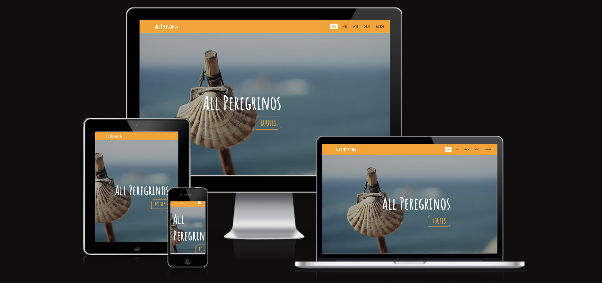

# All Peregrinos

All peregrinos webiste was created for pilgrims who are interested in starting their own Caminos de Santiago advtenture. The website is aimed at those who have questions about how to get started and offers guidance on what it is you they can expect when planning their journey.

 Users will be guided through possible routes they might choose to take, they will learn from others who have shared their own experiences of the routes they have chosen to take. The website also provides contact information if the user so wishes to seek further advice or get involved in the community on social media.

 

 The final site can be viewed at - [All Peregrinos live website](https://fullstacksd.github.io/HTML-CSSresponsive/)

 
&nbsp;

## Features 

Navigation 
 
 The navigation bar sits at the top of the page and outlines the companys name in the left corner: All Peregrinos that links to the home page. 

 Other links that are centered link to the Routes section, Advice Section, Contact section and the footer section that containslinks to social media websites.

 The theme of the website refelects the views and colours that would be experienced while out walking on the Caminos de Santiago. The blues and contrastin yellows are typical colours seen on the offical camino logo so, we have adapted these colours to make the website clean and enjoyable to use.

