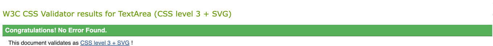
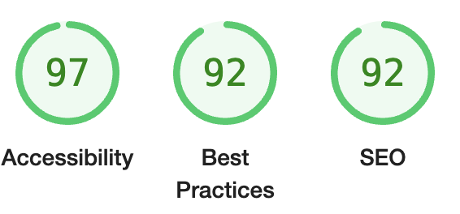

# All Peregrinos

All peregrinos webiste was created for pilgrims who are interested in starting their own Caminos de Santiago advtenture. The website is aimed at those who have questions about how to get started and offers guidance on what it is you they can expect when planning their journey.

 Users will be guided through possible routes they might choose to take, they will learn from others who have shared their own experiences of the routes they have chosen to take. The website also provides contact information if the user so wishes to seek further advice or get involved in the community on social media.

 

 The final site can be viewed at - [All Peregrinos live website](https://fullstacksd.github.io/HTML-CSSresponsive/)

 
&nbsp;

## Features 

### Navigation 
 
 - The navigation bar sits at the top of the page and outlines the companys name in the left corner: All Peregrinos that links to the home page. 

 - Other links that are centered link to the Routes section, Advice Section, Contact section and the footer section that containslinks to social media websites.

 - The theme of the website refelects the views and colours that would be experienced while out walking on the Caminos de Santiago. The blues and contrastin yellows are typical colours seen on the offical camino logo so, we have adapted these colours to make the website clean and enjoyable to use.

 - The user is easily able to navigate around the page and back to the home page using the navigation bar.

&nbsp;

 ## Home
 

### The header

- The Home section of the website clearly outlines the name of the website and uses vibrant, contrasting colours to reflect the ethos and imagery of the Camino. 

- The home section is a simple hero image of a typical image of the Caminos shell whcih contains the name of the page along with a navigation button to redirect the user to the Routes section.

- This section has an effective user experience and encourages the user to feel at ease navigating around the site.

&nbsp;

## The Advice Section 

- This section contains a set of cards detailing other pilgrims adventures on their own Caminos. The cards alos depict images that may be experinecd by a walker on the camino specifice to the routes that have been detailed in the cards.

- This section aims to encourage the website user to become curious about what to expect on the camino and expand their knowledge on routes they my not have known about before.

- For an enjoyable and satisfying User Experience, the cards use a hover animation which helps to bring the images to life aiming to immerse the user in the camino experience.

&nbsp;

## Contact Section 

- The user finds all the conatct information they may need in the contact section.

- This section has been split into three separate cards that detail telephone number, email and physical address.

- The aim here was to keep the section as simple as possible in order to portray important information, should the user wish to get in touch with the company.

&nbsp;

## Questions Section

- This section invites users to participate and become active users of the site.

- The questions section is titled "Get in Touch" to make sure users feel welcomed and able to ask any questions that may have come to them during the time they have been using the website.

- The Questions section is valuable as it creates a sense of community for the user. By asking them to share their own information, the site is able to keep track with them and their progress, and also take their time to respond in detail to any questions submitted by the user.

&nbsp;

## The Footer Section 

- The footer section contains the sites tag line along with the final heading of "All Peregrinos" to leave the user with our coompany image.

- There are three social medai icons that are linked to their respective social media websites, furher encouraging user participation and links to the company. 

- The footer is the final image that sticks with the user and stick with the overall design and layout of the site.

&nbsp;

## Testing 

- I tested this page using different browsers such as Chrome, Firefox and Safari.

- I confirmed this project as responsive. I made sure there was a pleasant user experience and functions well on all standard screen sizes using the devtools device in the toolbar.

- All sections listed above are easily readable and understandable.

- The form is interactive and works well. It requires the user to enter specific details into each field ie. the email field will only accept email etc.

&nbsp;

## Bugs 

#### Solved Bugs

- When I was creating a responsive nav bar hamburger menu, I realised the z-index was incorrect and therefore was hiding my whole navigavtion behind the hero image. 

- My solution was to change the position to absolute and add a z-index of 2. I also added opacity of .7 for an enjoyable user experience.

&nbsp;

# Validator Testing

- ## HTML
    - No errors were returned when passing through the official W3C validator. 

- ## CSS 
    - No errors were returned when passing through the official (Jigsaw) validator. 

- ## Accessibilty
    - I confirmed that the colours and the fonts that I chose are easy to read and accessible by running it through lighthousde in devtools.

## Unfixed bugs 

- No unfixed bugs

&nbsp;

# Deployment

- The site was deployed to GitHub pages. The steps to deploy are as follows:
    - In the GitHub repository, navigate to the Settings tab
    - From the source section drop-down menu, select the Master Branch 
    - Once the master branch has been selected, the page provided the link to the completed website.

The final site can be viewed at - [All Peregrinos live website](https://fullstacksd.github.io/HTML-CSSresponsive/)

&nbsp;

# Credits 

## Media 

- The images chosen were taken from google and facebook.
- The content was created by me, Shannon Davidson taking my own experience of the Camino de Santiago into account.